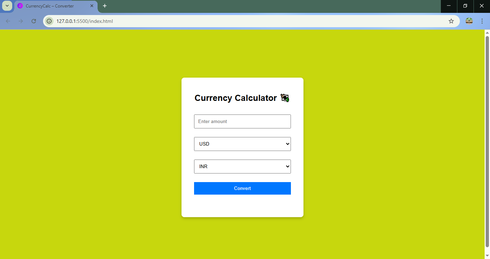
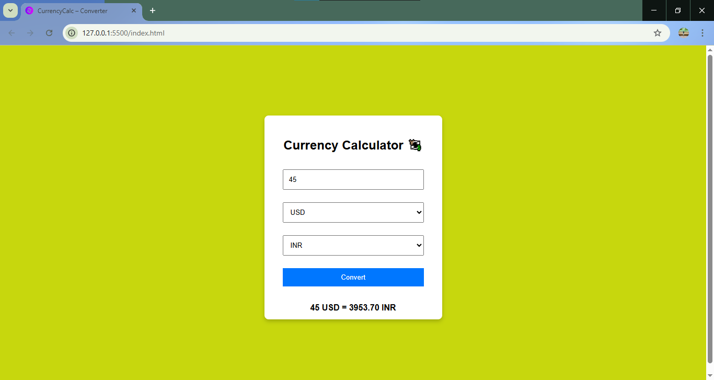

# 💱 CurrencyCalc – Currency Converter

A simple and responsive **Currency Converter Web App** built using **JavaScript, REST API, HTML, and CSS**.
It allows users to convert between multiple international currencies with real-time exchange rates.
<br>

## 🚀 Features
- 🌍 Convert between 150+ currencies using **ExchangeRate API** .
- 🖥 Responsive design for desktop & mobile.
- 💾 Remembers last used currencies and amount via **localStorage** .
- 🔄 Loading spinner while fetching API data.
- ⚠️ Error handling for invalid inputs or API issues.
- 📈 Future ready: Can be extended with **historical charts (Chart.js)** .  
<br>

## 🛠️ Tech Stack
- **Frontend:** HTML5, CSS3, JavaScript (ES6)  
- **API:** [ExchangeRate API](https://api.exchangerate-api.com/)  
- **Storage:** LocalStorage for saving preferences  
- **Hosting (Optional):** GitHub Pages / Netlify  
<br>

## 📂 Project Structure
```
/CurrencyCalc
├── index.html # Main UI
├── style.css # Styles & responsive design
└── script.js # App logic (API calls, conversions, storage)
```
<br>

## ⚙️ Installation & Setup
1. **Clone the repository**
   ```bash
   git clone https://github.com/your-username/CurrencyCalc.git
   cd CurrencyCalc

2. Open the app
   - Just open index.html in your browser.
   - No server setup required (pure client-side app).

3. Optional: Deploy on GitHub Pages
   - Push code to your repo
   - Go to Settings > Pages > Deploy from branch
   - Your app will be live! 🎉
  <br>
  
## 📸 Screenshots
<h3 align="center"> This is our app Home Page.</h3> <br>


<br>

<hr>
<h3 align="center"> This is our app Currency Conversion Page.</h3> <br>



<br>

## 🔮 Future Enhancements

- 📊 Adding historical currency trends with Chart.js

- 🌐 Multi-language support

- 🌓 Dark/Light mode toggle

- 💹 Graphs for exchange rate comparisons
<br>

## 🤝 Contributing
Pull requests are welcome! For major changes, please open an issue first to discuss what you’d like to change.
<br>


## 👨‍💻 Author
Developed by Pabitra Kumar Sahoo ✨
